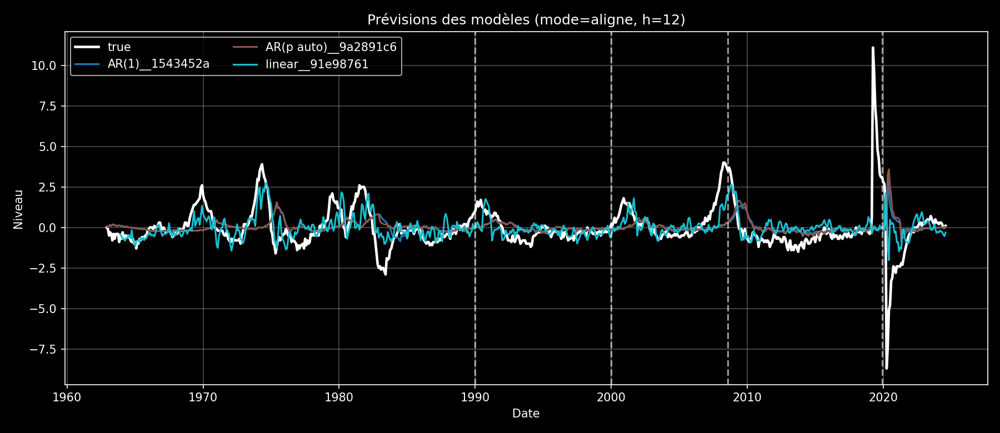
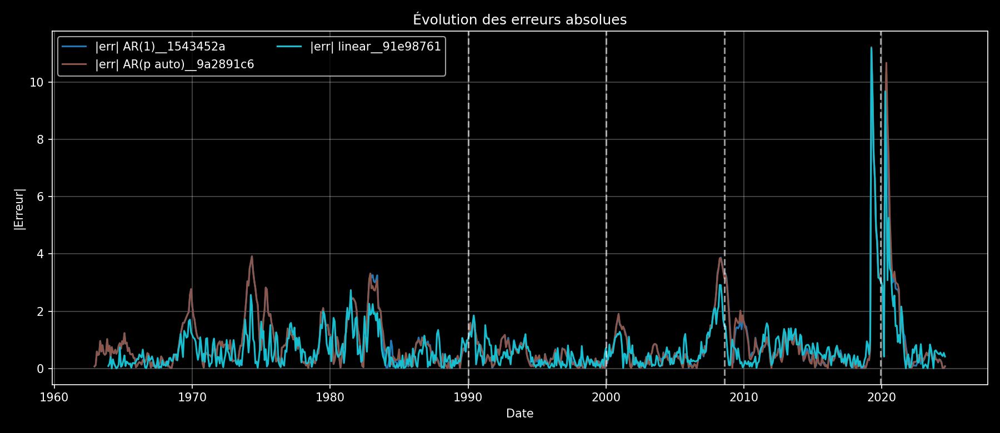

# Comparison Report — 8a88d7fbc4d5

## Inputs

- horizon (h): **12**
- mode: **aligne**
- run_ids:
  - `91e987618f30f5f4`
  - `1543452ae9c1c8c8`
  - `9a2891c636365b0c`

## Metrics

| method               |   validation.rmse |   validation.mae |   validation.r2 |   validation.n |   test.rmse |   test.mae |   test.r2 |   test.n |
|:---------------------|------------------:|-----------------:|----------------:|---------------:|------------:|-----------:|----------:|---------:|
| AR(1)__1543452a      |            1.0648 |           0.6798 |         -0.8639 |             84 |      1.6208 |     0.8798 |   -0.1003 |      416 |
| AR(p auto)__9a2891c6 |            1.0124 |           0.6859 |         -0.6849 |             84 |      1.6652 |     0.8770 |   -0.1615 |      416 |
| linear__91e98761     |            0.7573 |           0.5384 |          0.0572 |             84 |      1.4125 |     0.7644 |    0.1643 |      416 |

## Figures

### Forecasts

### Absolute errors

